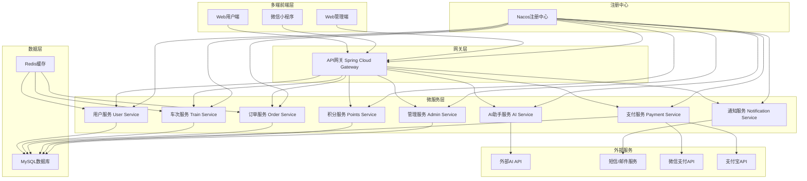
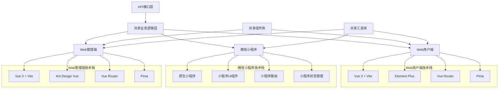
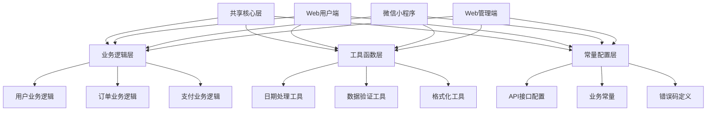
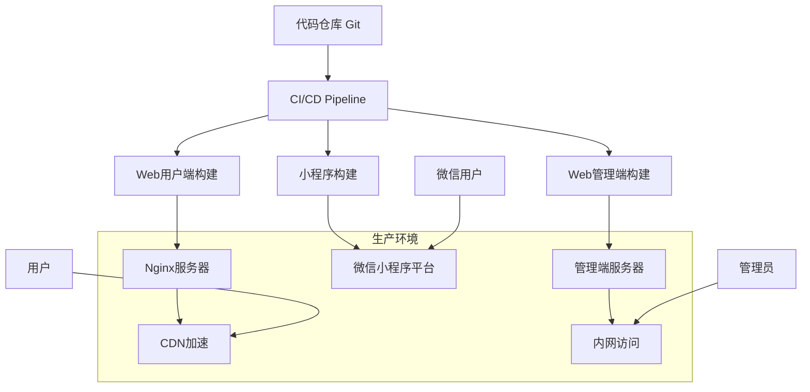
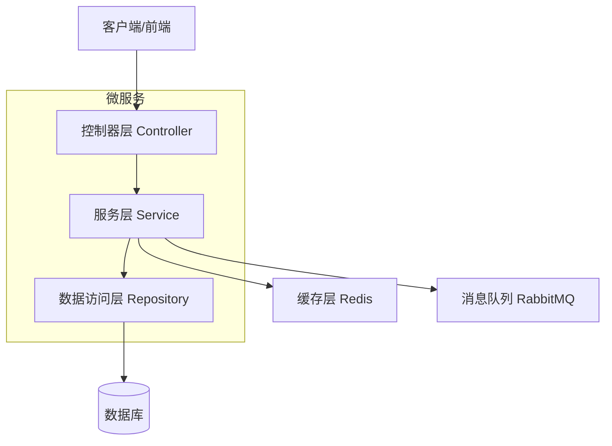
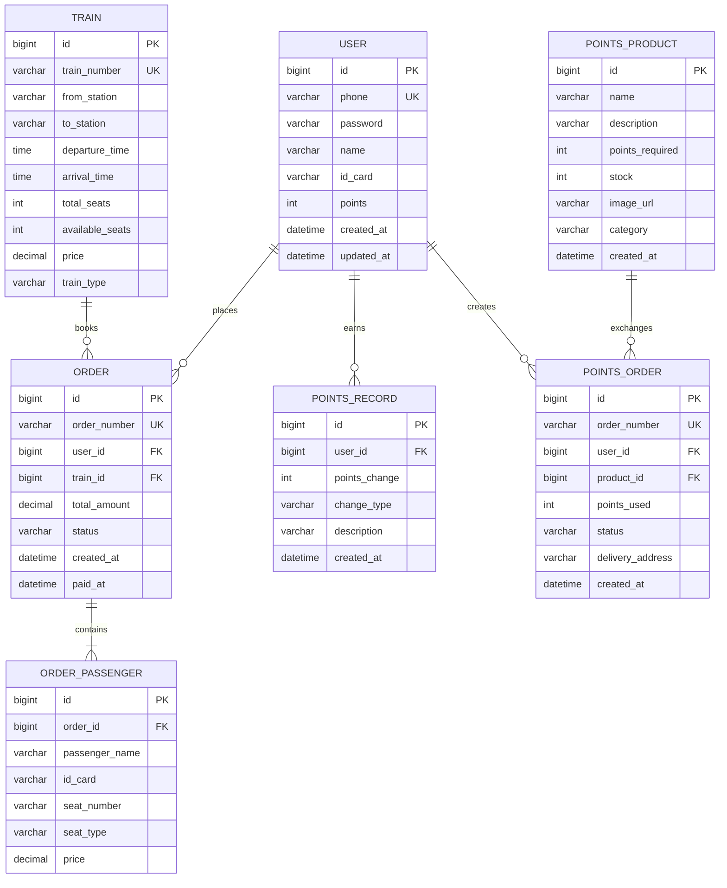

# 仿12306铁路微服务系统技术架构文档

## 1. 多端架构设计

### 1.1 整体架构图



### 1.2 前端多端架构



## 2. 多端技术描述

### 2.1 前端技术栈

**Web用户端**
* **框架**: Vue.js@3 + Vite@5
* **UI组件库**: Element Plus@2.4
* **路由管理**: Vue Router@4
* **状态管理**: Pinia@2.1
* **HTTP客户端**: Axios@1.6
* **构建工具**: Vite + TypeScript
* **样式处理**: SCSS + PostCSS

**微信小程序端**
* **开发框架**: 微信原生小程序
* **UI组件库**: WeUI + 自定义组件
* **状态管理**: 全局数据管理
* **网络请求**: wx.request封装
* **构建工具**: 微信开发者工具
* **支付集成**: 微信支付API

**Web管理端**
* **框架**: Vue.js@3 + Vite@5
* **UI组件库**: Ant Design Vue@4.0
* **路由管理**: Vue Router@4
* **状态管理**: Pinia@2.1
* **图表库**: ECharts@5.4
* **表格组件**: Ant Design Table
* **权限控制**: 基于角色的访问控制(RBAC)

### 2.2 后端技术栈

* **微服务框架**: Spring Cloud@2023.0.0 + Spring Boot@3.2.0
* **服务网关**: Spring Cloud Gateway
* **服务注册**: Nacos@2.3.0
* **服务调用**: OpenFeign
* **负载均衡**: Spring Cloud LoadBalancer
* **熔断器**: Resilience4j

### 2.3 数据存储

* **关系数据库**: MySQL@8.0
* **缓存数据库**: Redis@7.0
* **消息队列**: RabbitMQ@3.12
* **文件存储**: MinIO/阿里云OSS

### 2.4 运维监控

* **服务监控**: Spring Boot Admin + Micrometer
* **链路追踪**: SkyWalking
* **日志收集**: ELK Stack
* **容器化**: Docker + Docker Compose

## 3. 多端路由定义

### 3.1 Web用户端路由

| 路由                        | 用途                 |
| ------------------------- | ------------------ |
| /                         | 首页，展示搜索功能和热门线路推荐   |
| /search                   | 车次查询页面，显示搜索结果和筛选条件 |
| /booking/:trainId         | 选座购票页面，座位选择和乘客信息填写 |
| /payment/:orderId         | 支付页面，订单确认和支付方式选择   |
| /user/login               | 用户登录页面             |
| /user/register            | 用户注册页面             |
| /user/profile             | 个人中心，用户信息管理        |
| /user/orders              | 我的订单，订单历史和管理       |
| /points/mall              | 积分商城，积分商品展示        |
| /points/detail/:productId | 积分商品详情页            |
| /ai-assistant             | AI助手页面，智能客服和推荐     |

### 3.2 微信小程序页面路径

| 页面路径                      | 用途                 |
| --------------------------- | ------------------ |
| pages/index/index           | 小程序首页，搜索和推荐功能      |
| pages/search/search         | 车次查询页面             |
| pages/booking/booking       | 选座购票页面             |
| pages/payment/payment       | 支付页面               |
| pages/user/login            | 用户登录页面             |
| pages/user/profile          | 个人中心               |
| pages/user/orders           | 我的订单               |
| pages/points/mall           | 积分商城               |
| pages/points/detail         | 积分商品详情             |
| pages/ai/assistant          | AI助手页面             |

### 3.3 Web管理端路由

| 路由                        | 用途                 |
| ------------------------- | ------------------ |
| /admin                    | 管理后台首页，数据概览        |
| /admin/login              | 管理员登录页面            |
| /admin/users              | 用户管理，用户列表和操作       |
| /admin/trains             | 车次管理，车次信息维护        |
| /admin/orders             | 订单管理，订单查询和处理       |
| /admin/points             | 积分管理，积分商品和规则       |
| /admin/statistics         | 数据统计，销售和用户分析       |
| /admin/system             | 系统设置，参数配置          |
| /admin/logs               | 日志管理，系统日志查看        |

## 4. API定义

### 4.1 用户认证相关

**用户登录**

```
POST /api/user/login
```

请求参数:

| 参数名      | 参数类型   | 是否必填 | 描述  |
| -------- | ------ | ---- | --- |
| phone    | string | true | 手机号 |
| password | string | true | 密码  |
| captcha  | string | true | 验证码 |

响应参数:

| 参数名     | 参数类型   | 描述         |
| ------- | ------ | ---------- |
| code    | number | 响应状态码      |
| message | string | 响应消息       |
| data    | object | 用户信息和token |

示例:

```json
{
  "phone": "13800138000",
  "password": "123456",
  "captcha": "1234"
}
```

**车次查询**

```
GET /api/train/search
```

请求参数:

| 参数名       | 参数类型   | 是否必填  | 描述   |
| --------- | ------ | ----- | ---- |
| from      | string | true  | 出发站  |
| to        | string | true  | 到达站  |
| date      | string | true  | 出发日期 |
| trainType | string | false | 车次类型 |

**订单创建**

```
POST /api/order/create
```

请求参数:

| 参数名         | 参数类型   | 是否必填 | 描述     |
| ----------- | ------ | ---- | ------ |
| trainId     | string | true | 车次ID   |
| passengers  | array  | true | 乘客信息列表 |
| seatType    | string | true | 座位类型   |
| seatNumbers | array  | true | 座位号列表  |

**支付处理**

```
POST /api/payment/pay
```

请求参数:

| 参数名           | 参数类型   | 是否必填 | 描述   |
| ------------- | ------ | ---- | ---- |
| orderId       | string | true | 订单ID |
| paymentMethod | string | true | 支付方式 |
| amount        | number | true | 支付金额 |

### 4.2 积分商城API

**积分商品列表**

```
GET /api/points/products
```

**积分兑换**

```
POST /api/points/exchange
```

### 4.3 AI助手API

**智能对话**

```
POST /api/ai/chat
```

**行程推荐**

```
GET /api/ai/recommend
```

## 5. 多端代码复用策略

### 5.1 共享代码层设计



### 5.2 代码复用实现方案

**1. 共享业务逻辑**
- 创建独立的业务逻辑模块，封装核心业务流程
- 使用TypeScript定义统一的数据类型和接口
- 实现平台无关的业务处理函数

**2. 共享工具函数**
- 日期时间处理：格式化、计算、验证
- 数据验证：表单验证、身份证验证、手机号验证
- 数据格式化：价格格式化、文本处理
- 网络请求封装：统一的HTTP请求处理

**3. 共享常量配置**
- API接口地址配置
- 业务常量定义（车次类型、订单状态等）
- 错误码和提示信息
- 正则表达式模式

**4. 平台适配层**
- Web端：基于Axios的HTTP客户端
- 小程序端：基于wx.request的网络请求
- 存储适配：localStorage vs 小程序storage
- 路由适配：Vue Router vs 小程序导航

### 5.3 组件复用策略

**Web端组件复用**
- 用户端和管理端共享基础组件
- 创建通用的表单组件、表格组件、图表组件
- 使用组件库的主题定制功能区分用户端和管理端样式

**跨平台组件设计**
- 定义统一的组件接口规范
- Web端使用Vue组件，小程序端使用自定义组件
- 保持相同的props和events定义

## 6. 多端部署方案

### 6.1 部署架构图



### 6.2 部署配置

**Web用户端部署**
- 构建工具：Vite打包生成静态文件
- Web服务器：Nginx配置反向代理和静态资源服务
- CDN加速：静态资源托管到CDN，提升访问速度
- 域名配置：用户端独立域名，支持HTTPS

**微信小程序部署**
- 开发工具：微信开发者工具进行代码上传
- 版本管理：小程序版本发布和灰度测试
- 审核发布：提交微信审核后正式发布
- 数据统计：微信小程序数据助手监控

**Web管理端部署**
- 内网部署：管理端部署在内网环境，确保安全性
- 权限控制：VPN或专线访问，IP白名单限制
- 负载均衡：多实例部署，Nginx负载均衡
- 监控告警：系统监控和日志告警

### 6.3 环境配置

**开发环境**
```bash
# Web用户端
npm run dev:user

# Web管理端  
npm run dev:admin

# 小程序开发
# 使用微信开发者工具打开小程序目录
```

**生产环境**
```bash
# Web用户端构建
npm run build:user

# Web管理端构建
npm run build:admin

# 小程序构建
npm run build:miniprogram
```

### 6.4 持续集成配置

**Jenkins Pipeline示例**
```groovy
pipeline {
    agent any
    stages {
        stage('代码检出') {
            steps {
                git 'https://github.com/railway-system/frontend.git'
            }
        }
        stage('依赖安装') {
            steps {
                sh 'npm install'
            }
        }
        stage('代码检查') {
            steps {
                sh 'npm run lint'
                sh 'npm run test'
            }
        }
        stage('构建部署') {
            parallel {
                stage('用户端') {
                    steps {
                        sh 'npm run build:user'
                        sh 'rsync -av dist/user/ user@server:/var/www/user/'
                    }
                }
                stage('管理端') {
                    steps {
                        sh 'npm run build:admin'
                        sh 'rsync -av dist/admin/ admin@server:/var/www/admin/'
                    }
                }
            }
        }
    }
}
```

## 7. 服务架构图



## 8. 数据模型

### 8.1 数据模型定义



### 8.2 数据定义语言

**用户表 (users)**

```sql
-- 创建用户表
CREATE TABLE users (
    id BIGINT PRIMARY KEY AUTO_INCREMENT,
    phone VARCHAR(11) UNIQUE NOT NULL COMMENT '手机号',
    password VARCHAR(255) NOT NULL COMMENT '密码',
    name VARCHAR(50) NOT NULL COMMENT '姓名',
    id_card VARCHAR(18) COMMENT '身份证号',
    points INT DEFAULT 0 COMMENT '积分余额',
    status TINYINT DEFAULT 1 COMMENT '状态：1-正常，0-禁用',
    created_at DATETIME DEFAULT CURRENT_TIMESTAMP,
    updated_at DATETIME DEFAULT CURRENT_TIMESTAMP ON UPDATE CURRENT_TIMESTAMP
);

-- 创建索引
CREATE INDEX idx_users_phone ON users(phone);
CREATE INDEX idx_users_id_card ON users(id_card);
```

**车次表 (trains)**

```sql
-- 创建车次表
CREATE TABLE trains (
    id BIGINT PRIMARY KEY AUTO_INCREMENT,
    train_number VARCHAR(10) UNIQUE NOT NULL COMMENT '车次号',
    from_station VARCHAR(50) NOT NULL COMMENT '出发站',
    to_station VARCHAR(50) NOT NULL COMMENT '到达站',
    departure_time TIME NOT NULL COMMENT '出发时间',
    arrival_time TIME NOT NULL COMMENT '到达时间',
    total_seats INT NOT NULL COMMENT '总座位数',
    available_seats INT NOT NULL COMMENT '可用座位数',
    price DECIMAL(10,2) NOT NULL COMMENT '票价',
    train_type VARCHAR(10) NOT NULL COMMENT '车型：G-高铁，D-动车，T-特快，K-快速',
    status TINYINT DEFAULT 1 COMMENT '状态：1-正常，0-停运',
    created_at DATETIME DEFAULT CURRENT_TIMESTAMP
);

-- 创建索引
CREATE INDEX idx_trains_route ON trains(from_station, to_station);
CREATE INDEX idx_trains_number ON trains(train_number);
CREATE INDEX idx_trains_type ON trains(train_type);
```

**订单表 (orders)**

```sql
-- 创建订单表
CREATE TABLE orders (
    id BIGINT PRIMARY KEY AUTO_INCREMENT,
    order_number VARCHAR(32) UNIQUE NOT NULL COMMENT '订单号',
    user_id BIGINT NOT NULL COMMENT '用户ID',
    train_id BIGINT NOT NULL COMMENT '车次ID',
    total_amount DECIMAL(10,2) NOT NULL COMMENT '总金额',
    status VARCHAR(20) DEFAULT 'PENDING' COMMENT '订单状态：PENDING-待支付，PAID-已支付，CANCELLED-已取消',
    created_at DATETIME DEFAULT CURRENT_TIMESTAMP,
    paid_at DATETIME NULL COMMENT '支付时间',
    FOREIGN KEY (user_id) REFERENCES users(id),
    FOREIGN KEY (train_id) REFERENCES trains(id)
);

-- 创建索引
CREATE INDEX idx_orders_user_id ON orders(user_id);
CREATE INDEX idx_orders_status ON orders(status);
CREATE INDEX idx_orders_created_at ON orders(created_at DESC);
```

**积分商品表 (points\_products)**

```sql
-- 创建积分商品表
CREATE TABLE points_products (
    id BIGINT PRIMARY KEY AUTO_INCREMENT,
    name VARCHAR(100) NOT NULL COMMENT '商品名称',
    description TEXT COMMENT '商品描述',
    points_required INT NOT NULL COMMENT '所需积分',
    stock INT DEFAULT 0 COMMENT '库存数量',
    image_url VARCHAR(255) COMMENT '商品图片',
    category VARCHAR(50) COMMENT '商品分类',
    status TINYINT DEFAULT 1 COMMENT '状态：1-上架，0-下架',
    created_at DATETIME DEFAULT CURRENT_TIMESTAMP
);

-- 初始化数据
INSERT INTO points_products (name, description, points_required, stock, category) VALUES
('星巴克咖啡券', '星巴克中杯咖啡兑换券', 500, 100, '餐饮'),
('电影票', '全国通用电影票', 800, 50, '娱乐'),
('手机充值卡', '50元手机话费充值', 1000, 200, '通讯');
```

