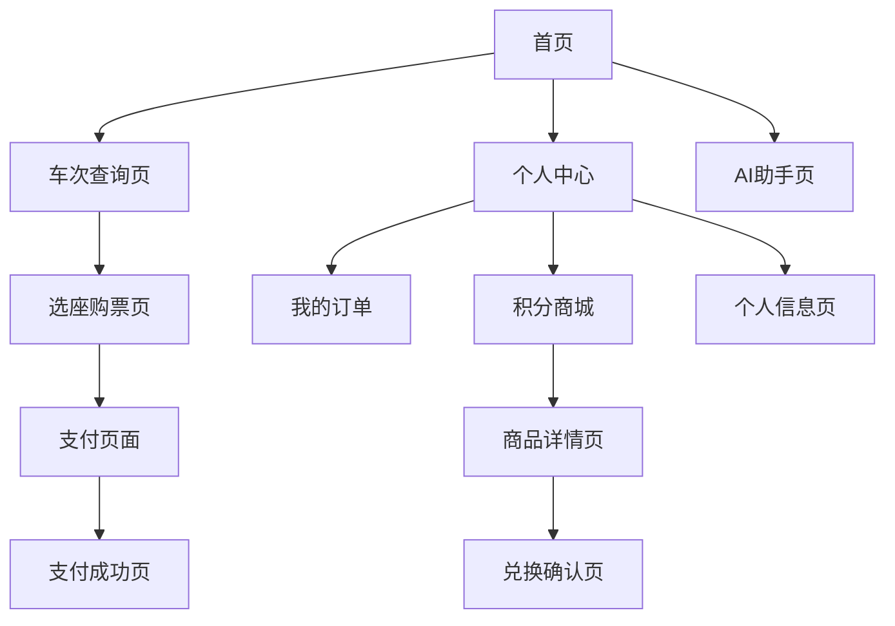

# 仿12306铁路微服务系统需求文档

## 1. 产品概述

本项目旨在开发一个仿12306的铁路微服务系统，为用户提供便捷的火车票预订、管理和相关服务。系统采用Vue.js前端框架和SpringCloud微服务后端架构，具备高并发、高可用、可扩展的特性。

系统主要解决用户火车票预订、行程管理、积分兑换等需求，目标用户为广大出行旅客，通过智能化服务提升用户体验。

项目目标是构建一个功能完善、性能优异的现代化铁路票务系统，支持千万级用户并发访问。

## 2. 核心功能

### 2.1 用户角色

| 角色 | 注册方式 | 核心权限 |
|------|----------|----------|
| 普通用户 | 手机号+验证码注册 | 购票、查询、个人信息管理、积分使用 |
| VIP用户 | 积分升级或付费升级 | 优先购票、专属客服、积分加成 |
| 管理员 | 内部分配账号 | 系统管理、数据统计、用户管理 |

### 2.2 功能模块

我们的铁路微服务系统包含以下主要模块：

1. **用户管理模块**：用户注册登录、个人信息管理、实名认证
2. **车次管理模块**：车次信息查询、时刻表管理、座位分布
3. **购票模块**：票务查询、在线购票、选座功能
4. **订单管理模块**：订单创建、支付、退改签处理
5. **支付模块**：多种支付方式、支付安全、退款处理
6. **积分商城模块**：积分获取、商品兑换、优惠券管理
7. **AI助手模块**：智能客服、行程推荐、问题解答
8. **通知模块**：短信通知、邮件提醒、系统消息
9. **数据统计模块**：销售统计、用户行为分析、运营报表

### 2.3 页面详情

| 页面名称 | 模块名称 | 功能描述 |
|----------|----------|----------|
| 首页 | 导航栏 | 显示Logo、主导航菜单、用户登录状态 |
| 首页 | 搜索区域 | 出发地、目的地选择，日期选择，乘客类型选择 |
| 首页 | 热门线路 | 展示热门车次推荐、特价票信息 |
| 车次查询页 | 筛选条件 | 按时间、车型、座位类型筛选车次 |
| 车次查询页 | 车次列表 | 显示车次信息、余票数量、价格、选择按钮 |
| 选座购票页 | 座位图 | 可视化座位选择、座位状态显示 |
| 选座购票页 | 乘客信息 | 添加乘客、实名认证信息填写 |
| 选座购票页 | 订单确认 | 订单详情确认、总价计算 |
| 支付页面 | 支付方式 | 支付宝、微信、银行卡等支付选项 |
| 支付页面 | 订单信息 | 显示订单详情、支付金额 |
| 个人中心 | 我的订单 | 订单历史、状态查询、退改签操作 |
| 个人中心 | 个人信息 | 基本信息编辑、实名认证管理 |
| 个人中心 | 我的积分 | 积分余额、获取记录、使用记录 |
| 积分商城 | 商品列表 | 积分商品展示、分类筛选 |
| 积分商城 | 商品详情 | 商品介绍、积分价格、兑换按钮 |
| AI助手页 | 智能对话 | 聊天界面、常见问题、语音输入 |
| AI助手页 | 行程推荐 | 基于用户偏好的智能推荐 |

## 3. 核心流程

**用户购票流程：**
用户首先在首页搜索车次，系统展示可用车次列表。用户选择合适车次后进入选座页面，添加乘客信息并选择座位。确认订单信息后进入支付页面完成支付，系统生成电子票并发送通知。

**积分兑换流程：**
用户进入积分商城浏览商品，选择心仪商品查看详情。确认兑换后系统扣除相应积分，生成兑换订单并安排发货。

**AI助手服务流程：**
用户通过文字或语音与AI助手交互，系统智能识别用户意图并提供相应服务。包括车次查询、购票指导、问题解答等功能。

## 4. 用户界面设计

### 4.1 设计风格

- **主色调**：蓝色系(#1890FF)为主色，白色(#FFFFFF)为背景色
- **辅助色**：绿色(#52C41A)表示成功，红色(#FF4D4F)表示警告
- **按钮样式**：圆角矩形按钮，主按钮采用渐变蓝色
- **字体**：中文使用微软雅黑，英文使用Arial，主要字号14px-16px
- **布局风格**：卡片式布局，顶部导航栏固定
- **图标风格**：线性图标风格，简洁现代

### 4.2 页面设计概览

| 页面名称 | 模块名称 | UI元素 |
|----------|----------|--------|
| 首页 | 导航栏 | 蓝色渐变背景，白色Logo和菜单文字，右侧登录按钮 |
| 首页 | 搜索区域 | 白色卡片容器，蓝色搜索按钮，日期选择器采用日历组件 |
| 首页 | 热门线路 | 网格布局卡片，每张卡片包含线路图片、价格标签 |
| 车次查询页 | 筛选条件 | 侧边栏布局，折叠面板展示筛选项，蓝色选中状态 |
| 车次查询页 | 车次列表 | 表格布局，斑马纹背景，余票数量用颜色区分紧张程度 |
| 选座购票页 | 座位图 | SVG绘制座位图，绿色可选，灰色已占，蓝色已选中 |
| 支付页面 | 支付方式 | 单选按钮组，每个支付方式配图标，选中状态高亮 |
| 个人中心 | 侧边菜单 | 垂直导航菜单，图标+文字组合，当前页面高亮显示 |
| 积分商城 | 商品卡片 | 商品图片、名称、积分价格，悬停效果阴影加深 |
| AI助手页 | 聊天界面 | 气泡对话框，用户消息右对齐蓝色，AI回复左对齐灰色 |

### 4.3 响应式设计

系统采用移动端优先的响应式设计，支持桌面端、平板端和移动端访问。移动端优化触摸交互，按钮尺寸不小于44px，支持手势操作如滑动选择日期等。