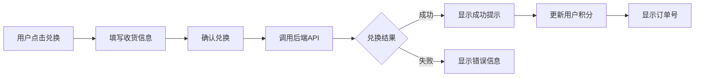
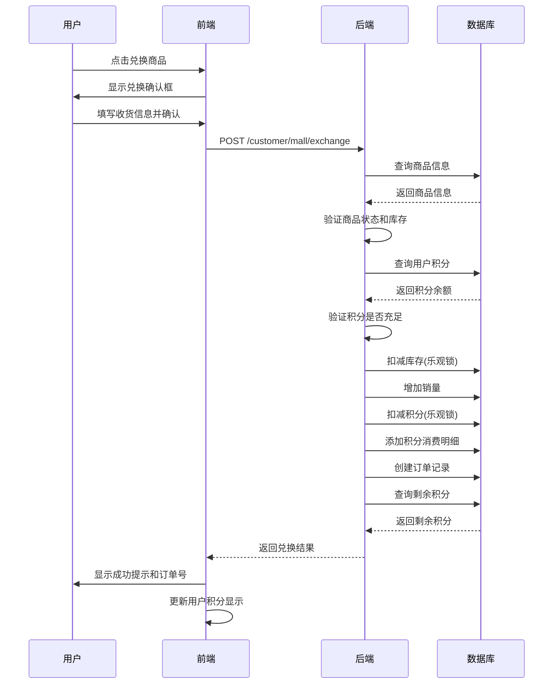
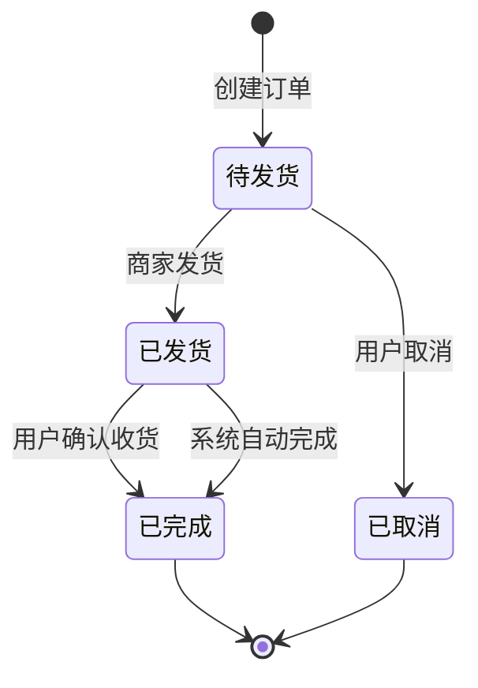
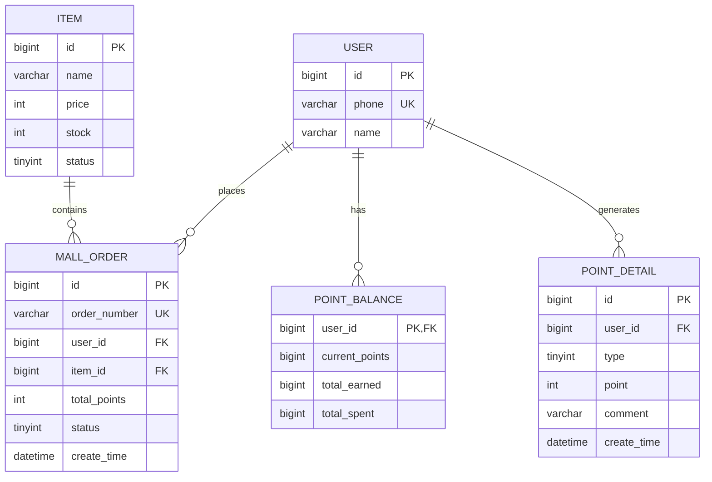

# 积分商城订单系统设计与实现文档

## 📋 项目概述

本文档描述了积分商城订单系统的完整设计与实现,包括数据库设计、后端 API 开发和前端交互实现。

---

## 🗄️ 一、数据库设计

### 1.1 商城订单表 (mall_order)

**表名:** `mall_order`

**用途:** 存储用户使用积分兑换商品的订单信息

**表结构:**

| 字段名            | 数据类型     | 约束                        | 说明                           |
| ----------------- | ------------ | --------------------------- | ------------------------------ |
| id                | BIGINT       | PK, AUTO_INCREMENT          | 订单主键 ID                    |
| order_number      | VARCHAR(50)  | UNIQUE, NOT NULL            | 订单号(格式: EX+时间戳+序列号) |
| user_id           | BIGINT       | NOT NULL, INDEX             | 用户 ID                        |
| item_id           | BIGINT       | NOT NULL, INDEX             | 商品 ID                        |
| item_name         | VARCHAR(200) | NOT NULL                    | 商品名称(冗余)                 |
| item_image        | VARCHAR(500) | NULL                        | 商品图片(冗余)                 |
| quantity          | INT          | NOT NULL, DEFAULT 1         | 兑换数量                       |
| unit_price        | INT          | NOT NULL                    | 单价(积分)                     |
| total_points      | INT          | NOT NULL                    | 总积分                         |
| recipient_name    | VARCHAR(50)  | NOT NULL                    | 收货人姓名                     |
| recipient_phone   | VARCHAR(20)  | NOT NULL                    | 联系电话                       |
| recipient_address | VARCHAR(500) | NOT NULL                    | 收货地址                       |
| status            | TINYINT      | NOT NULL, DEFAULT 0, INDEX  | 订单状态                       |
| ship_time         | DATETIME     | NULL                        | 发货时间                       |
| complete_time     | DATETIME     | NULL                        | 完成时间                       |
| cancel_time       | DATETIME     | NULL                        | 取消时间                       |
| remark            | VARCHAR(500) | NULL                        | 备注                           |
| create_time       | DATETIME     | DEFAULT CURRENT_TIMESTAMP   | 创建时间                       |
| update_time       | DATETIME     | ON UPDATE CURRENT_TIMESTAMP | 更新时间                       |
| create_by         | BIGINT       | NULL                        | 创建人                         |
| update_by         | BIGINT       | NULL                        | 修改人                         |

**订单状态说明:**

- `0`: 待发货 (订单创建后的初始状态)
- `1`: 已发货 (商品已发货)
- `2`: 已完成 (用户确认收货或系统自动完成)
- `3`: 已取消 (用户取消或系统取消)

**索引设计:**

- PRIMARY KEY: `id`
- UNIQUE KEY: `order_number`
- INDEX: `user_id`, `item_id`, `status`, `create_time`

### 1.2 订单号生成规则

**格式:** `EX + yyyyMMddHHmmss + 6位序列号`

**示例:** `EX202412091234560000001`

**说明:**

- `EX`: 订单类型前缀,表示 Exchange(兑换)
- `yyyyMMddHHmmss`: 14 位时间戳
- `6位序列号`: 循环使用,防止同一秒内订单号重复

---

## 🔧 二、后端实现

### 2.1 实体类设计

#### MallOrder (商城订单实体)

**位置:** `rs-util/rs-common/src/main/java/com/rs/model/mall/MallOrder.java`

**关键字段:**

```java
private Long id;                    // 订单ID
private String orderNumber;          // 订单号
private Long userId;                 // 用户ID
private Long itemId;                 // 商品ID
private Integer totalPoints;         // 总积分
private Integer status;              // 订单状态
```

#### ExchangeReqDTO (兑换请求 DTO)

**位置:** `rs-service/rs-mall/src/main/java/com/rs/model/dto/req/ExchangeReqDTO.java`

**字段:**

```java
private Long itemId;                 // 商品ID
private Integer quantity;            // 兑换数量
private String recipientName;        // 收货人姓名
private String recipientPhone;       // 联系电话
private String recipientAddress;     // 收货地址
```

**验证规则:**

- `itemId`: @NotNull
- `quantity`: @NotNull, @Min(1)
- `recipientName`: @NotBlank
- `recipientPhone`: @NotBlank
- `recipientAddress`: @NotBlank

#### ExchangeResDTO (兑换响应 DTO)

**位置:** `rs-service/rs-mall/src/main/java/com/rs/model/dto/res/ExchangeResDTO.java`

**字段:**

```java
private Boolean success;             // 是否成功
private String orderNumber;          // 订单号
private Long remainingPoints;        // 剩余积分
```

### 2.2 Mapper 层

#### MallOrderMapper

**位置:** `rs-service/rs-mall/src/main/java/com/rs/mapper/MallOrderMapper.java`

**主要方法:**

- `int createOrder(MallOrder order)` - 创建订单
- `MallOrder findByOrderNumber(String orderNumber)` - 根据订单号查询
- `List<MallOrder> findByUserId(Long userId)` - 查询用户订单列表
- `int updateStatus(String orderNumber, Integer status)` - 更新订单状态

#### ItemMapper (扩展)

**新增方法:**

- `int deductStock(Long itemId, Integer quantity)` - 扣减库存(乐观锁)
- `int increaseSold(Long itemId, Integer quantity)` - 增加销量

#### PointMapper (扩展)

**新增方法:**

- `int deductPoints(Long userId, Integer points)` - 扣减积分(乐观锁)
- `void addSpendDetail(PointDetail pointDetail)` - 添加积分消费明细

### 2.3 Service 层

#### MallOrderServiceImpl

**位置:** `rs-service/rs-mall/src/main/java/com/rs/service/impl/MallOrderServiceImpl.java`

**核心业务逻辑:**

```java
@Transactional(rollbackFor = Exception.class)
public ExchangeResDTO exchange(ExchangeReqDTO exchangeReqDTO) {
    // 1. 获取当前用户ID
    // 2. 查询商品信息并验证(状态、库存)
    // 3. 计算总积分
    // 4. 查询用户积分余额并验证
    // 5. 扣减库存(乐观锁)
    // 6. 增加销量
    // 7. 扣减积分(乐观锁)
    // 8. 添加积分消费明细
    // 9. 创建订单记录
    // 10. 查询剩余积分并返回
}
```

**并发控制:**

- 使用乐观锁扣减库存: `WHERE stock >= quantity`
- 使用乐观锁扣减积分: `WHERE current_points >= points`
- 使用`@Transactional`保证事务原子性

**异常处理:**

- 用户未登录 → `BusinessException("用户未登录")`
- 商品不存在 → `BusinessException("商品不存在")`
- 商品已下架 → `BusinessException("商品已下架")`
- 库存不足 → `BusinessException("商品库存不足")`
- 积分不足 → `BusinessException("积分不足")`
- 库存扣减失败 → `BusinessException("库存扣减失败，商品可能已售罄")`
- 积分扣减失败 → `BusinessException("积分扣减失败，积分可能不足")`

### 2.4 Controller 层

#### MallOrderController

**位置:** `rs-service/rs-mall/src/main/java/com/rs/controller/user/MallOrderController.java`

**API 接口:**

| 接口路径                  | 请求方式 | 功能     | 鉴权     |
| ------------------------- | -------- | -------- | -------- |
| `/customer/mall/exchange` | POST     | 商品兑换 | 需要登录 |

**请求示例:**

```json
{
  "itemId": 100002672305,
  "quantity": 2,
  "recipientName": "张三",
  "recipientPhone": "13800138000",
  "recipientAddress": "北京市朝阳区xxx路xxx号"
}
```

**响应示例:**

```json
{
  "code": 200,
  "message": "success",
  "data": {
    "success": true,
    "orderNumber": "EX202412091234560000001",
    "remainingPoints": 8500
  }
}
```

---

## 🎨 三、前端实现

### 3.1 API 接口定义

**位置:** `rs-user-web/src/api/points.js`

**兑换商品接口:**

```javascript
export const exchangeProduct = (exchangeData) => {
  return request({
    url: "/customer/mall/exchange",
    method: "POST",
    data: exchangeData,
  });
};
```

### 3.2 页面交互逻辑

**位置:** `rs-user-web/src/view/mall/index.vue`

**兑换确认处理:**

```javascript
const handleConfirmExchange = async (data) => {
  try {
    const response = await exchangeProduct({
      itemId: data.product.id,
      quantity: data.quantity,
      recipientName: data.recipientName,
      recipientPhone: data.recipientPhone,
      recipientAddress: data.recipientAddress,
    });

    // 兑换成功
    exchangeOrderNumber.value = response.data.orderNumber;
    showExchangeModal.value = false;
    showSuccessModal.value = true;

    // 更新用户积分
    userPoints.value = response.data.remainingPoints;

    ElMessage.success("兑换成功！");
  } catch (error) {
    console.error("兑换失败:", error);
    ElMessage.error(error.response?.data?.message || "兑换失败，请稍后重试");
  }
};
```

### 3.3 数据流转



---

## 🔄 四、业务流程

### 4.1 下单流程



### 4.2 订单状态流转



---

## 📊 五、数据库 ER 图



---

## ✅ 六、功能清单

### 已完成功能

- [x] 商城订单表设计 (`mall_order`)
- [x] 订单实体类 (`MallOrder`)
- [x] 请求/响应 DTO (`ExchangeReqDTO`, `ExchangeResDTO`)
- [x] Mapper 接口和 XML 映射 (`MallOrderMapper.java/xml`)
- [x] 库存扣减方法 (`ItemMapper.deductStock`)
- [x] 销量增加方法 (`ItemMapper.increaseSold`)
- [x] 积分扣减方法 (`PointMapper.deductPoints`)
- [x] 积分消费明细记录 (`PointMapper.addSpendDetail`)
- [x] 下单业务逻辑 (`MallOrderServiceImpl.exchange`)
- [x] 下单 API 接口 (`MallOrderController.exchange`)
- [x] 前端 API 调用 (`exchangeProduct`)
- [x] 前端交互逻辑 (`handleConfirmExchange`)
- [x] 数据库 SQL 脚本 (`mall_order.sql`)

### 核心特性

1. **并发安全**

   - 乐观锁控制库存扣减
   - 乐观锁控制积分扣减
   - 事务保证原子性

2. **数据一致性**

   - 商品信息冗余存储
   - 积分扣减和订单创建在同一事务
   - 失败时自动回滚

3. **业务完整性**

   - 完整的参数验证
   - 详细的异常处理
   - 完善的日志记录

4. **可扩展性**
   - 清晰的分层架构
   - 标准的 RESTful API
   - 易于扩展的状态机制

---

## 🧪 七、测试建议

### 7.1 单元测试

- 库存扣减逻辑测试
- 积分扣减逻辑测试
- 订单号生成测试
- 并发场景测试

### 7.2 集成测试

- 完整下单流程测试
- 库存不足场景测试
- 积分不足场景测试
- 事务回滚测试

### 7.3 压力测试

- 并发下单压力测试
- 库存超卖测试
- 积分超扣测试

---

## 📝 八、注意事项

1. **库存扣减**: 使用乐观锁防止超卖,扣减失败时返回明确错误
2. **积分扣减**: 使用乐观锁防止超扣,扣减失败时返回明确错误
3. **订单号生成**: 使用时间戳+序列号保证唯一性
4. **数据冗余**: 商品名称、图片、价格等字段冗余存储,避免历史订单受影响
5. **事务管理**: 所有数据库操作在同一事务中,保证原子性
6. **异常处理**: 所有业务异常都有明确的错误信息返回给前端

---

## 🚀 九、部署说明

### 9.1 数据库初始化

1. 执行 SQL 脚本创建表:

```bash
mysql -u root -p rs-mall < mall_order.sql
```

2. 验证表结构:

```sql
DESC mall_order;
```

### 9.2 后端部署

1. 确保配置文件正确(`bootstrap-dev.yaml`)
2. 启动服务: `MallApplication.java`
3. 访问 Swagger 文档: `http://localhost:8080/doc.html`

### 9.3 前端部署

1. 安装依赖: `npm install`
2. 启动开发服务器: `npm run dev`
3. 访问页面: `http://localhost:5173/mall`

---

## 📚 十、相关文档

- [积分商城数据库设计.md](../../docs/积分商城数据库设计.md)
- [积分商城 API 接口文档.md](../../docs/积分商城API接口文档.md)
- [仿 12306 铁路微服务系统技术架构文档.md](../../docs/仿12306铁路微服务系统技术架构文档.md)

---

**文档版本:** v1.0  
**创建日期:** 2024-12-09  
**最后更新:** 2024-12-09  
**维护人员:** 开发团队
