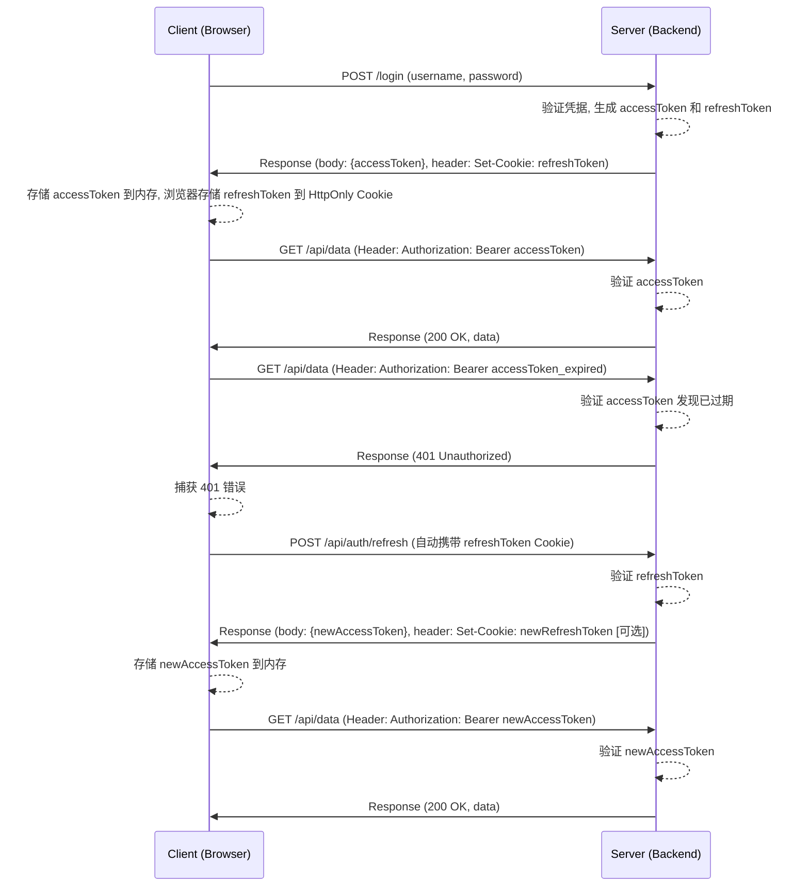

好的，这是一个非常经典且安全的现代Web应用认证鉴权方案。下面我将为你详细解析基于 `accessToken` + `refreshToken` + `HttpOnly Cookie` 的认证和鉴权模块是如何设计和工作的。

---

### 核心概念解析

首先，我们来理解这三个核心组件各自的角色：

1.  **Access Token (访问令牌)**
    *   **作用**: 用于访问受保护的资源（API）。客户端在每次请求需要授权的API时，都需要在请求头（通常是 `Authorization: Bearer <token>`）中携带它。
    *   **特点**:
        *   **生命周期短 (Short-lived)**: 通常只有几分钟到几小时（例如15分钟或1小时）。这大大降低了令牌泄露后的风险。
        *   **无状态 (Stateless)**: 通常是一个JWT (JSON Web Token)，包含了用户信息（如用户ID、角色等），服务端无需查询数据库即可验证其有效性和获取用户信息。
        *   **存储位置**: 存储在客户端的**内存**中（例如，JavaScript变量、Vuex/Redux等状态管理库中），**不应存储在 `localStorage` 或 `sessionStorage` 中**，因为它们容易受到XSS（跨站脚本攻击）的威胁。

2.  **Refresh Token (刷新令牌)**
    *   **作用**: 它的唯一作用是**获取新的Access Token**。当 Access Token 过期后，客户端会使用 Refresh Token 向服务器申请一个新的 Access Token，从而避免用户频繁重新登录。
    *   **特点**:
        *   **生命周期长 (Long-lived)**: 通常有几天、几周甚至几个月。
        *   **有状态 (Stateful)**: 服务端需要存储或有办法验证其有效性。通常会将其存储在数据库中，并与用户关联。这样可以在需要时（如用户修改密码、主动登出、发现令牌被盗）主动使其失效。
        *   **严格保密**: Refresh Token 的权限非常高，一旦泄露，攻击者可以持续刷新用户的登录状态。因此，它的安全性至关重要。

3.  **HttpOnly Cookie**
    *   **作用**: 这是**安全存储 Refresh Token 的载体**。
    *   **特点**:
        *   **`HttpOnly`**: 设置了此属性的 Cookie **无法通过 JavaScript 的 `document.cookie` API 访问**。这是防御XSS攻击的核心机制。即使攻击者在你的页面注入了恶意脚本，他也无法窃取到这个 Cookie 里的 Refresh Token。
        *   **`Secure`**: 保证 Cookie 只在 HTTPS 连接下传输，防止在传输过程中被窃听。
        *   **`SameSite`**: 防御CSRF（跨站请求伪造）攻击。`SameSite=Strict` 或 `SameSite=Lax` 可以限制该 Cookie 只在同站请求中被发送。
        *   **自动发送**: 浏览器会在向指定域名发送请求时自动携带匹配的 Cookie，无需前端代码手动操作。

---

### 完整工作流程

下面是这个认证模块从登录到登出的完整生命周期。

#### 1. 用户登录 (Login)

1.  **客户端**: 用户在登录页面输入用户名和密码，点击登录。前端将这些凭据发送到后端的 `/login` 接口。
2.  **服务端**:
    *   验证用户名和密码是否正确。
    *   验证通过后，生成两个令牌：
        *   一个短生命周期的 `accessToken` (JWT)。
        *   一个长生命周期的 `refreshToken`。
    *   将 `refreshToken` 存储在数据库或缓存中，并与用户ID关联。
    *   将令牌发送给客户端：
        *   `accessToken` 放在**响应体 (Response Body)** 的 JSON 数据中。
        *   `refreshToken` 放在一个配置了 `HttpOnly`, `Secure`, `SameSite=Strict` 的 **Cookie** 中。

**示例响应:**
*   **Response Header:**
    ```
    Set-Cookie: refreshToken=...; HttpOnly; Secure; SameSite=Strict; Path=/api/auth
    ```
*   **Response Body:**
    ```json
    {
      "accessToken": "eyJhbGciOiJIUzI1NiIsInR5cCI6IkpXVCJ9...",
      "user": {
        "id": "123",
        "username": "testuser"
      }
    }
    ```

3.  **客户端**:
    *   从响应体中获取 `accessToken` 和用户信息，并将它们存储在**内存**中（如 Redux/Vuex store）。
    *   浏览器自动处理 `Set-Cookie` 指令，将 `refreshToken` 存入 Cookie。

#### 2. 访问受保护的API (Authenticated Request)

1.  **客户端**: 当需要请求受保护的API（如 `/api/profile`）时，从内存中取出 `accessToken`，并将其放入请求的 `Authorization` 头中。
    ```javascript
    // 使用 axios 示例
    axios.get('/api/profile', {
      headers: {
        'Authorization': `Bearer ${accessToken}`
      }
    });
    ```
2.  **服务端**:
    *   收到请求后，从 `Authorization` 头中解析出 `accessToken`。
    *   验证 `accessToken` 的签名和有效期。
    *   如果验证通过，处理请求并返回数据。
    *   如果 `accessToken` **已过期**，返回 `401 Unauthorized` 状态码。

#### 3. 刷新 Access Token (Token Refresh)

这是整个流程的关键环节。

1.  **客户端**:
    *   API 请求返回 `401` 错误。
    *   客户端的请求逻辑（通常是一个统一的API请求拦截器，如 Axios Interceptor）捕获到这个 `401` 错误。
    *   拦截器自动向服务端的特定接口（如 `/api/auth/refresh`）发送一个**不带 `Authorization` 头**的请求。
    *   由于浏览器的机制，这个请求会**自动携带上存储在 `HttpOnly` Cookie 中的 `refreshToken`**。

2.  **服务端 (`/api/auth/refresh` 接口)**:
    *   从请求的 Cookie 中获取 `refreshToken`。
    *   在数据库中查找该 `refreshToken` 是否有效、是否过期、是否已被撤销。
    *   如果验证通过：
        *   生成一个新的 `accessToken`。
        *   **（可选但推荐）** 生成一个新的 `refreshToken`（这叫**刷新令牌旋转 Refresh Token Rotation**），旧的 `refreshToken` 作废。这可以防止旧 `refreshToken` 泄露后被永久使用。
        *   将新的 `accessToken` 放在响应体中返回。
        *   如果生成了新的 `refreshToken`，通过 `Set-Cookie` 头更新客户端的 Cookie。
    *   如果验证失败（例如 `refreshToken` 不存在或已失效），返回 `401` 或 `403` 错误，强制用户重新登录。

3.  **客户端**:
    *   接收到 `/refresh` 接口的响应，获得新的 `accessToken`。
    *   更新内存中的 `accessToken`。
    *   **使用新的 `accessToken` 重新发起之前失败的那个API请求**。
    *   对于用户来说，这个过程是无感的，他们不会察觉到令牌已经刷新。

#### 4. 用户登出 (Logout)

1.  **客户端**: 用户点击登出按钮，前端向后端 `/logout` 接口发送请求。
2.  **服务端**:
    *   从 Cookie 中获取 `refreshToken`。
    *   在数据库中**将该 `refreshToken` 标记为无效或直接删除**。
    *   向客户端返回一个指令，清空 `refreshToken` Cookie。通常是通过设置一个同名但内容为空且 `Max-Age` 为0的 `Set-Cookie` 头。
    ```
    Set-Cookie: refreshToken=; HttpOnly; Secure; SameSite=Strict; Path=/api/auth; Max-Age=0
    ```
3.  **客户端**:
    *   清除内存中的 `accessToken` 和用户信息。
    *   将用户重定向到登录页面。

---

### 架构图示



### 优缺点总结

#### 优点

*   **高安全性**:
    *   **防XSS**: `HttpOnly` Cookie 保护了高权限的 `refreshToken`，即使网站遭受XSS攻击，攻击者也无法窃取它。
    *   **防CSRF**: `SameSite` Cookie 属性提供了有效的CSRF保护。
    *   **令牌泄露风险低**: `accessToken` 生命周期短，即使被截获，其有效时间也很有限。
*   **良好用户体验**: 用户无需在 `accessToken` 过期后重新登录，刷新过程对用户透明。
*   **服务端扩展性好**: API服务器可以通过验证JWT `accessToken` 实现无状态鉴权，方便水平扩展。只有认证服务器（处理登录和刷新）需要与存储 `refreshToken` 的数据库交互。

#### 缺点

*   **实现稍复杂**: 相较于传统的 Session-Cookie 模式，该方案涉及的流程和组件更多。
*   **需要处理并发刷新**: 如果多个API请求同时因为 `accessToken` 过期而失败，它们可能会同时触发刷新流程。需要客户端逻辑来确保只发送一次刷新请求，并将其他失败的请求暂停，等待新令牌获取后再重试。
*   **需要管理 `refreshToken`**: 服务端需要一个存储机制来管理 `refreshToken` 的状态（有效、撤销等）。

总而言之，这套方案是目前构建现代化、高安全性的Web应用（尤其是前后端分离的SPA应用）时，最受推崇和广泛采用的认证鉴权模式之一。